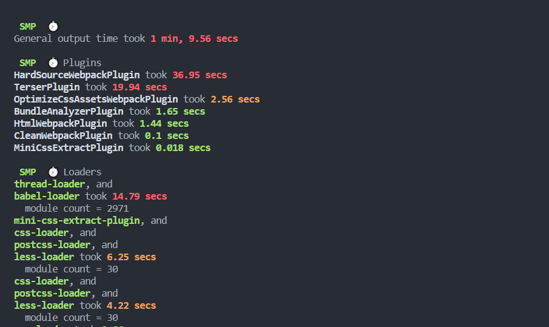
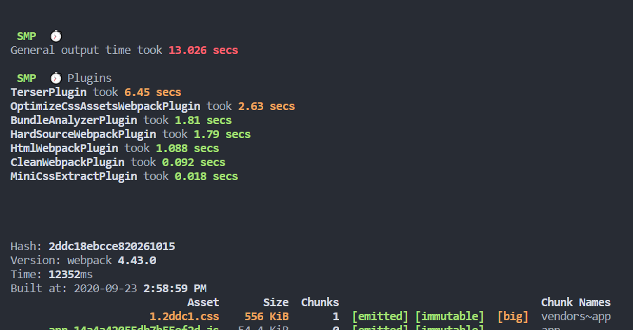
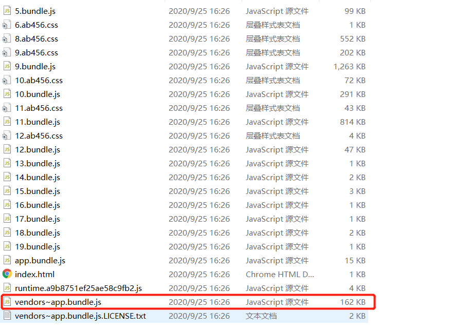

# 从零搭建一个react-hooks项目（五）

- 项目完成大概建起来了，但是当我打个生产包的时候都快哭了，一开始使用的devtool: "source-map"，用时高达 34 s，这当然是不可容忍的
- 然后我们先将devtool改为"none"，然后发现变为了29s


## 分析打包速度

- 通过 `speed-measure-webpack-plugin` 分析 `webpack` 构建期间各个阶段花费的时间，使用方法如下

```js
const SpeedMeasurePlugin = require("speed-measure-webpack-plugin");
const smp = new SpeedMeasurePlugin();
module.exports = smp.wrap(webpackConfig)
```

- 然后在打包时就会显示打包中各阶段花费的时间，显示如下

<!--more-->


- 不要在开发模式下使用这个分析插件，否则每次对代码进行修改都会导致webpack异常退出，报错 `Running webpack throws 'Callback was already called' error`

## 优化一 优化解析速度 - 多进程打包

- 正常的webpack打包是单线程的，文件只能挨个处理，针对大量文件就会很慢，所以官方推荐了 thread_loader ，这个loader放在其他loader之前，，那么它后面的loader就会在单独的worker进程（node.js process）中进行
- thread_loader使用很简单，将它引入并放到其他loader之前即可
- 注意：thread-loader 需要 style-loader 之后，这是因为 thread-loader 后的 loader 没法存取文件也没法获取 webpack 的选项设置。

```js
module.exports = {
  ...
  module: {
    rules: [
      {
        test: /\.(ts|js)x?$/,
        use: [
          'thread-loader',
          'babel-loader'
        ],
        exclude: /node-modules/
      }
    ]
  }
}
```

- 由于每个worker启动要600ms，为了防止worker启动的高延迟，我们可以进行预热

```js
const threadLoader = require('thread-loader');
const jsWorkerPool = {
  // options
  
  // 产生的 worker 的数量，默认是 (cpu 核心数 - 1)
  // 当 require('os').cpus() 是 undefined 时，则为 1
  workers: 2,
  
  // 闲置时定时删除 worker 进程
  // 默认为 500ms
  // 可以设置为无穷大， 这样在监视模式(--watch)下可以保持 worker 持续存在
  poolTimeout: 2000
};
threadLoader.warmup(jsWorkerPool, ['babel-loader']);

module.exports = {
  ...
  module: {
    rules: [
      {
        test: /\.(ts|js)x?$/,
        use: [
          {
            loader: 'thread-loader',
            options: jsWorkerPool
          },
          'babel-loader'
        ],
        exclude: /node-modules/
      }
    ]
  }
}

```

- 然后我们再尝试打包，分析一下babel-loader的时间


- 我们可以看到优化了将近 9 s

## 优化二 添加公用包的缓存

- 之前我们通过将不会发生变化的三方库进行抽离为dll文件，然后二次打包的时候不再对这些文件进行打包，以此来进行打包优化
- 不过由于webpack的升级，已经有了不差于dll的打包性能，所以我们不再考虑dll形式的打包
- DLL不明显了，但是有了更好的替代品 hard-source-webpack-plugin ，只需要简单引入，之后第一次打包的时候可能会慢一点，但是从第二次开始就可以看到明显的差别
- 使用方法如下
  
```js
const HardSourceWebpackPlugin = require('hard-source-webpack-plugin');

module.exports = {
  ...
  plugins: [
    new HardSourceWebpackPlugin(),
  ],
}
```

- 之后我们再来对比一下，第一次打包



- 可以看到第一次的打包长中HardSourceWebpackPlugin 占了 30多s，几乎跟打包时常一样了
- 但是当我们第二次打包的时候



- 这时神奇的事发生了，我们的打包时间变得只有13s了，缩短了60%

## 优化三 vendor代码分离

- 我们发现打出来的三方库的包vendor只有一个，体积达到了 2.6 M，这样对我们的首次加载是极其不友好的


- 导致vendor包过大的原因主要是我们的react组件都是同步引入的，导致webpack打包时认为是首页就需要的全部组件，从而将所有的依赖与文件都打到了一起
- 解决这个问题我们就需要react的按需引入功能，配合webpack本身的异步分离打包实现vendor包的优化
- react本身支持异步导入，但是因为我们的项目使用了babel，所以我们需要确保babel可以解析异步导入语句，并能正确解析，所以引入 'babel-plugin-syntax-dynamic-import' ,使用方法如下

```js
// 首先引入
yarn add babel-plugin-syntax-dynamic-import -D -S
// 然后修改 .babelrc 文件
"plugins": [
  "syntax-dynamic-import",
  ...
]

```

- 这样就保证我们可以正常使用react的异步导入方法了
- 然后因为我们使用了typescript，并且配置项中的module是 es6 ，但是该模式下不支持异步导入，所以将其修改为 commonjs，如下

```js
// tsconfig.json
{
  "compilerOptions": {
    ...
    "module": "commonjs", // 模块引入方式
  }
}
```

- 然后就完成了webpack基本项的配置，接下来就要修改我们的react代码
- 我们使用react提供的 lazy 方法对组件页面进行异步引入

```js
// 原代码
import * as React from 'react'
import Home from 'pages/home'

// 异步导入
import * as React from 'react'
const { lazy } = React
const Home = lazy(() => import('pages/home'))
```

- 按这种形式将我们的所有页面引入都修改了，然后再进行打包尝试，打包后的结果如下



- 可以看到我们的vendor变成了 160 多k，并且将原来的大文件拆分为很多小的bundle文件，这对我们的首屏加载有很大的帮助

## 优化四 cdn引入

- 当前项目打包完成后能发现 echarts 的模块体积太大，这时我们就要对 echarts 进行cdn引入了，避免打包体积大影响我们的页面加载，如下
- 移除 package.json 中的依赖
- html中新增script标签引入echarts 
- 配置webpack中的externals，使其能够正确的查找到 echarts 的依赖

```js
// 引入cdn
<script src="https://cdn.staticfile.org/echarts/4.3.0/echarts.min.js"></script>


// 然后修改 webpack.common.js 文件
"externals": {
  echarts: "echarts"
},

```

## 优化五 添加打包进度

- 采用依赖库 webpackbar 即可实现打包进度，

```js
// 首先引入
yarn add webpackbar -D
// 然后修改 webpack.common.js 文件
const webpackBar = require('webpackbar')

module.exports = {
  ...,
  plugins: [
    new webpackBar({
      name: devMode ? '启动中' : '打包中',
      color: '#3c99b0',
    })
  ],
}

```
